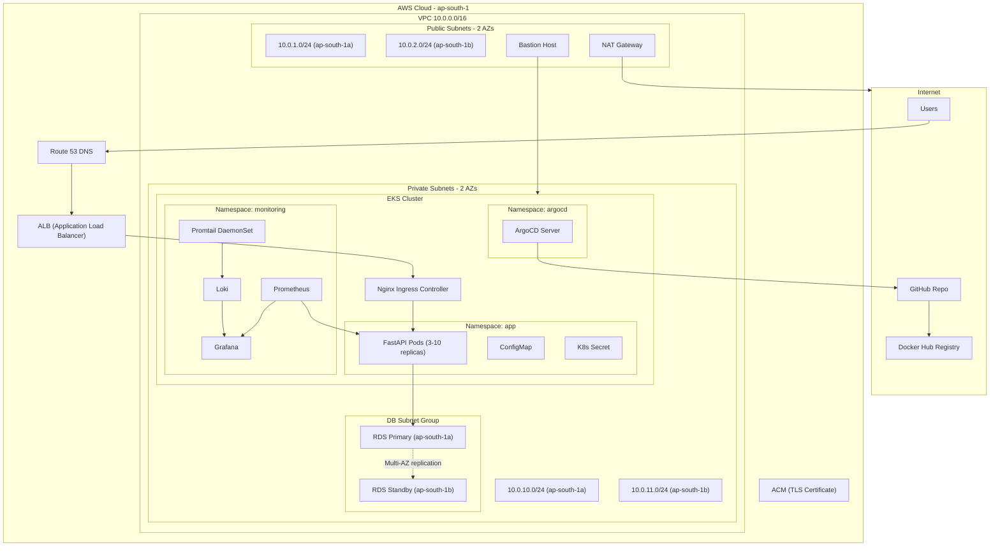
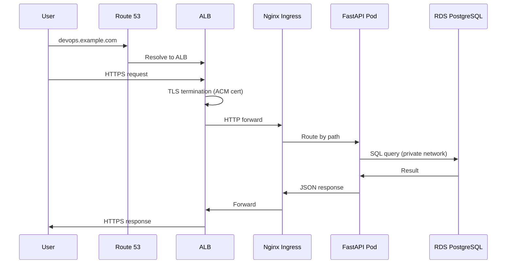

# Production Architecture - High-Level Design (HLD)

## 1. System Overview

This document describes the production architecture for the FastAPI DevOps project deployed on AWS using EKS, RDS, and a full CI/CD GitOps pipeline.



## 2. Component Breakdown

| Component | Service | Purpose | Location |
|-----------|---------|---------|----------|
| **FastAPI** | Application server | Handles HTTP requests, serves API | EKS private subnet |
| **PostgreSQL** | RDS Multi-AZ | Persistent data storage with automatic failover | Private subnet, DB subnet group |
| **Nginx Ingress** | Ingress Controller | Routes external traffic to pods, TLS termination | EKS private subnet |
| **ALB** | AWS Load Balancer | Internet-facing entry point, distributes traffic | Public subnet |
| **Route 53** | DNS | Domain name resolution | AWS global |
| **ACM** | Certificate Manager | TLS/SSL certificate for HTTPS | AWS global |
| **Prometheus** | Metrics collection | Scrapes app and infrastructure metrics | EKS monitoring namespace |
| **Grafana** | Dashboards | Visualizes metrics and logs | EKS monitoring namespace |
| **Loki** | Log aggregation | Stores and indexes logs | EKS monitoring namespace |
| **Promtail** | Log collector | Ships container logs to Loki | EKS DaemonSet (all nodes) |
| **ArgoCD** | GitOps controller | Syncs K8s manifests from Git to cluster | EKS argocd namespace |
| **NAT Gateway** | Network | Allows private subnets to reach internet (pull images) | Public subnet |
| **Bastion Host** | SSH access | Secure entry point for cluster debugging | Public subnet |

## 3. Network Topology

### VPC Design: 10.0.0.0/16

```
VPC (10.0.0.0/16)
├── Public Subnets (internet-facing)
│   ├── 10.0.1.0/24  (ap-south-1a)  -- ALB, NAT Gateway, Bastion
│   └── 10.0.2.0/24  (ap-south-1b)  -- ALB (multi-AZ)
│
├── Private Subnets (no direct internet access)
│   ├── 10.0.10.0/24 (ap-south-1a)  -- EKS worker nodes
│   └── 10.0.11.0/24 (ap-south-1b)  -- EKS worker nodes
│
└── DB Subnets (most restricted)
    ├── 10.0.10.0/24 (ap-south-1a)  -- RDS primary
    └── 10.0.11.0/24 (ap-south-1b)  -- RDS standby
```

### Security Groups

| Security Group | Inbound Rules | Outbound Rules |
|---------------|---------------|----------------|
| **ALB SG** | 80/443 from 0.0.0.0/0 | All to EKS SG |
| **EKS Node SG** | All from ALB SG; All within self | All outbound |
| **RDS SG** | 5432 from EKS Node SG only | None |
| **Bastion SG** | 22 from admin IP | All to EKS SG |

### Traffic Flow



## 4. CI/CD Pipeline Flow

```mermaid
sequenceDiagram
    participant Dev as Developer
    participant GH as GitHub
    participant GA as GitHub Actions
    participant DH as Docker Hub
    participant Argo as ArgoCD
    participant EKS as EKS Cluster

    Dev->>GH: Push code to main
    GH->>GA: Trigger pipeline

    rect rgb(40, 40, 60)
    Note over GA: Stage 1: Test
    GA->>GA: Install dependencies
    GA->>GA: Lint (ruff)
    GA->>GA: Unit tests (pytest)
    end

    rect rgb(40, 60, 40)
    Note over GA: Stage 2: Build
    GA->>GA: Build Docker image
    GA->>DH: Push image:sha-abc123
    GA->>DH: Push image:latest
    end

    rect rgb(60, 40, 40)
    Note over GA: Stage 3: Deploy
    GA->>GH: Update image tag in k8s/deployment.yml
    end

    GH-->>Argo: Detects Git change (polling)
    Argo->>EKS: Sync new deployment
    EKS->>DH: Pull image:sha-abc123
    EKS->>EKS: Rolling update (zero downtime)
    Argo->>Argo: Mark Synced + Healthy
```



## 5. Kubernetes Architecture

### Namespace Layout

| Namespace | Resources | Purpose |
|-----------|-----------|---------|
| **app** | Deployment, Service, Ingress, HPA, PDB, ConfigMap, Secret, NetworkPolicy | Application workloads |
| **monitoring** | Prometheus, Grafana, Loki, Promtail, PVCs, Services | Observability stack |
| **argocd** | ArgoCD Server, Repo Server, Application Controller | GitOps engine |
| **ingress-nginx** | Nginx Ingress Controller, Service (LoadBalancer) | Traffic routing |

### Scaling Strategy

| Metric | Min | Max | Target |
|--------|-----|-----|--------|
| Replicas | 3 | 10 | -- |
| CPU utilization | -- | -- | 70% |
| Pod Disruption Budget | 2 available | -- | -- |

### Resource Allocation Per Pod

| Resource | Request | Limit |
|----------|---------|-------|
| CPU | 250m | 500m |
| Memory | 128Mi | 256Mi |

## 6. Database Design

| Property | Value |
|----------|-------|
| Engine | PostgreSQL 15 |
| Instance class | db.t3.micro (dev) / db.r6g.large (prod) |
| Multi-AZ | Yes (automatic failover) |
| Storage | 20 GB gp3, auto-scaling to 100 GB |
| Backup | Automated, 7-day retention |
| Encryption | At rest (KMS) + in transit (SSL) |
| Access | Private subnet only, EKS security group |

## 7. Disaster Recovery

| Scenario | Recovery Method | RTO | RPO |
|----------|----------------|-----|-----|
| Pod crash | K8s auto-restart (liveness probe) | ~30s | 0 |
| Node failure | EKS reschedules pods to healthy node | ~2min | 0 |
| AZ failure | Multi-AZ RDS failover + pods in other AZ | ~5min | 0 |
| Region failure | Not covered (single-region design) | N/A | N/A |
| Bad deployment | ArgoCD rollback to previous Git commit | ~2min | 0 |
| Data corruption | RDS point-in-time recovery | ~30min | 5min |

## 8. Cost Estimate (ap-south-1)

| Resource | Spec | Monthly Cost (approx) |
|----------|------|----------------------|
| EKS Cluster | Control plane | $72 |
| EC2 (2x t3.medium nodes) | EKS workers | $60 |
| RDS (db.t3.micro, Multi-AZ) | PostgreSQL | $28 |
| ALB | Load Balancer | $22 |
| NAT Gateway | + data transfer | $35 |
| Route 53 | Hosted zone | $1 |
| S3 (Terraform state) | Minimal storage | $1 |
| **Total** | | **~$219/month** |
